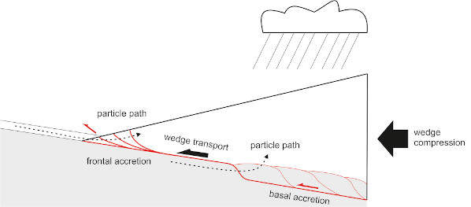
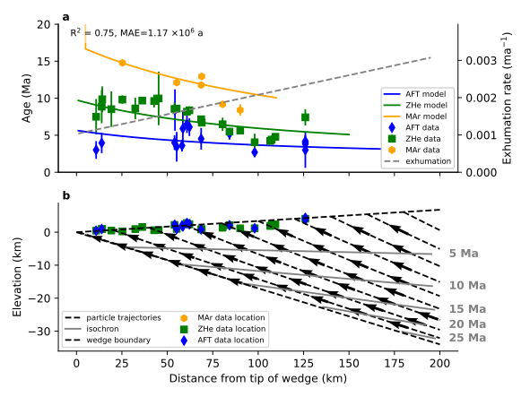

# Wedgex

[](https://doi.org/10.5281/zenodo.4571576)

## Introduction

Wedgex is a new analytical solution for the steady-state deformation and exhumation of an orogenic wedge, i.e. a simplified geometrical representation of a mountain belt. The analytical equation represents transport along a basal detachment, uniform internal deformation, basal and frontal accretion. The resulting rock particle trajectories and can be compared to thermochronology data that record the temperature history of rocks, such as apatite or zircon (U-Th)/He or fission track data.

Conceptual model of an orogenic wedge  |  Modelled particle trajectories, exhumation and thermochronology data
:-------------------------------------:|:-------------------------------------:
          |  


## Getting started

### with a Jupyter notebook:

Run the jupyter notebook [wedgex.ipynb](wedgex_multiple_runs_and_calibration.ipynb) to calculate particle trajectories and thermochronometer ages and, optionally, to calibrate parameter values to find the best match to thermochronometer data.


### or by running a minimal example:

The wedge exhumation equations are contained in a python module named [wedgeqs.py](wedgeqs.py). See the [minimal_example.py](minimal_example.py) below on how to use the equation to calculate x and y positions of a rock particle inside the wedge over time:

````python
import numpy as np
import matplotlib.pyplot as pl
import wedgeqs

t = np.linspace(0, -10e6, 101)
x0, L = 100e3, 200e3
alpha, beta = 0.05, -0.15
vc, vd, vxa, vya = -8e-3, -2e-3, 0.0, 0.0

x, y = wedgeqs.analytical_solution(t, x0, alpha, beta, L, vc, vd, vxa, vya)

fig, ax = pl.subplots(1, 1)
sc = ax.scatter(x/1000.0, y/1000.0, c=t/1e6, s=5)
cb = fig.colorbar(sc, shrink=0.5)
cb.set_label('Age (Ma)')
ax.set_xlabel('Distance (km)')
ax.set_ylabel('Elevation (km)')
fig.show()
````

This example is also included as a python script: [minimal_example.py](minimal_example.py). Run the minimal example by navigating to the wedgex directory and typing the following in a terminal or windows powershell: `python minimal_example.py`


## Installation

* Download the zip file or [clone](https://docs.github.com/en/github/creating-cloning-and-archiving-repositories/cloning-a-repository) the repository.
* Unzip the file, navigate to the directory and run the minimal example or one of the [Jupyter](https://jupyter.org/) notebooks.


## Required Python modules

Wedgex requires the following Python modules:
[numpy](https://numpy.org/), [matplotlib](https://matplotlib.org/), [pandas](https://pandas.pydata.org/), [scipy](https://www.scipy.org/) and [scikit-learn](https://scikit-learn.org)

In addition [Jupyter](https://jupyter.org/) needs to be installed to be able to run the notebooks.

Note that all of these modules and Jupyter are included in a Python distribution such as [Anaconda](https://www.anaconda.com/distribution/)

## Additional notebooks

* The notebook [model_validation/wedgex_validation.ipynb](model_validation/wedgex_validation.ipynb) contains additional model validation figures and can be used to reproduce several figures in the accompanying publication.
* The notebook [utilities/extract_xsection_data.ipynb](utilities/extract_xsection_data.ipynb) can be used to automatically extract thermochronology data along a cross-section. The cross-section is defined by a shapefile ([data/xsections.shp](data/xsections.shp)), and the thermchronology data are located in a csv file ([data/thermochron_data.csv](data/thermochron_data.csv)).

## Authors
**Elco Luijendijk**, University of Göttingen & RWTH Aachen, <elco.luijendijk-at-posteo.de>


## Reference

This notebook has been published at Zenodo. Please cite the following reference if you publish any work that uses this notebook:

Luijendijk, E. (2021). wedgex: calculate the exhumation of an orogenic wedge. Zenodo. [https://doi.org/10.5281/zenodo.4571576](https://doi.org/10.5281/zenodo.4571576)

[](https://doi.org/10.5281/zenodo.4571576)


## License
This project is licensed under the GNU lesser general public license (LGPL v3). See the [LICENSE.txt](LICENSE.txt) file for details.


